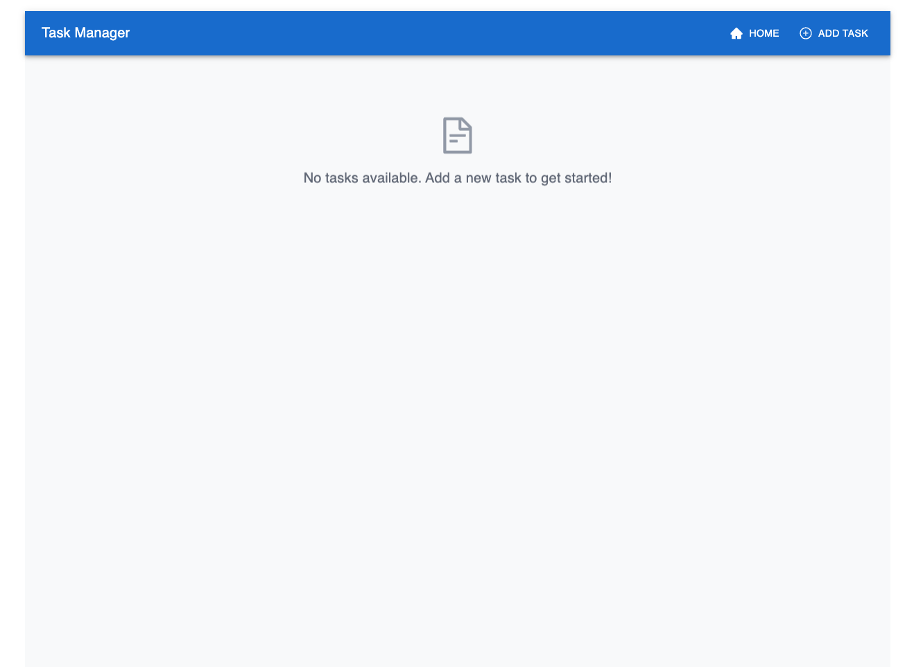
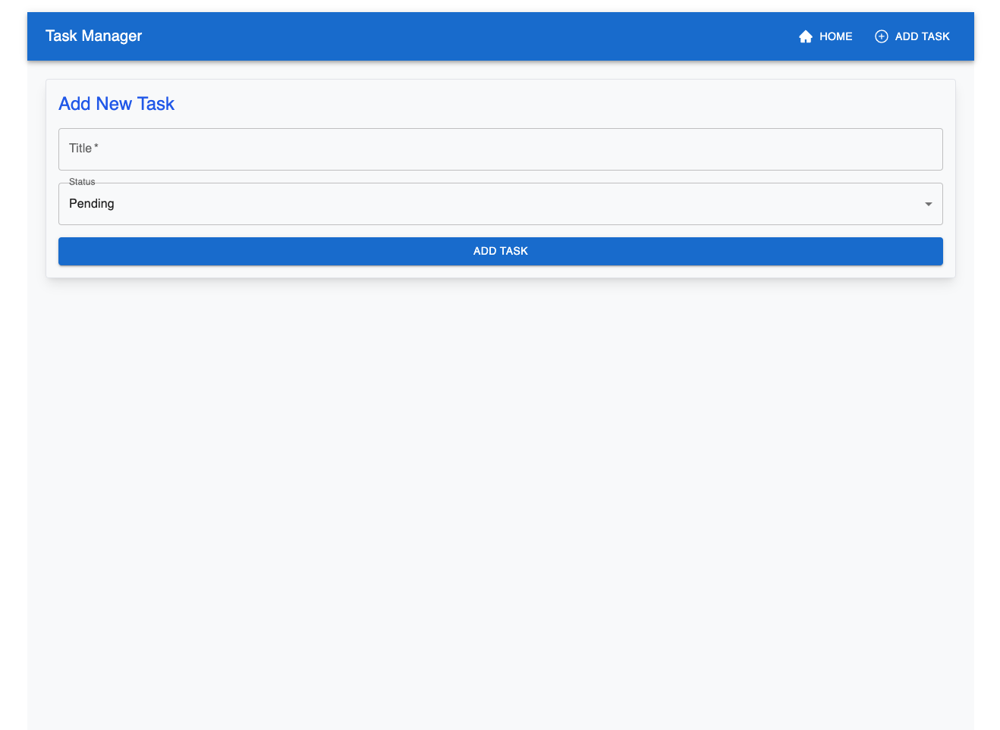
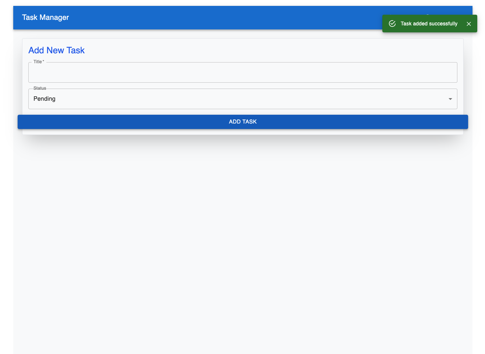
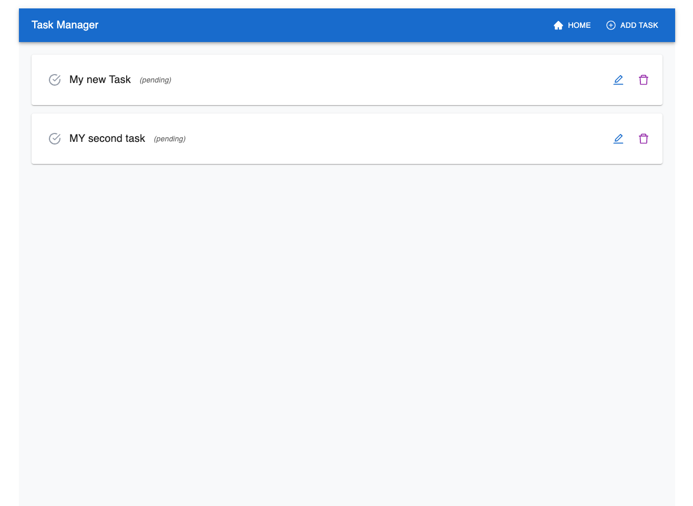
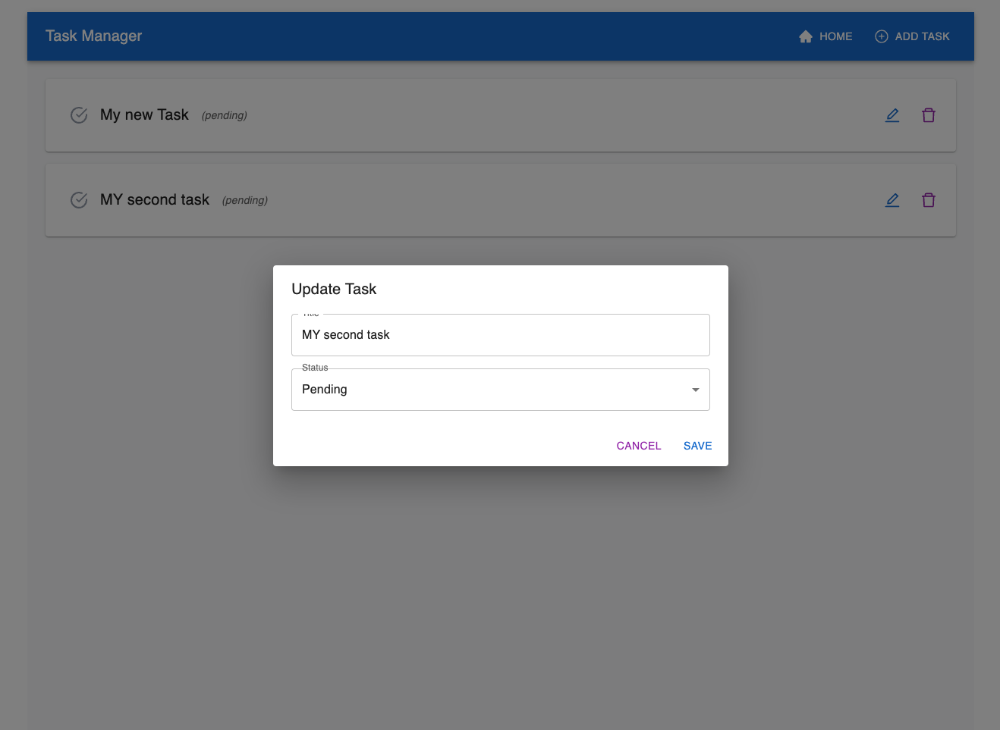
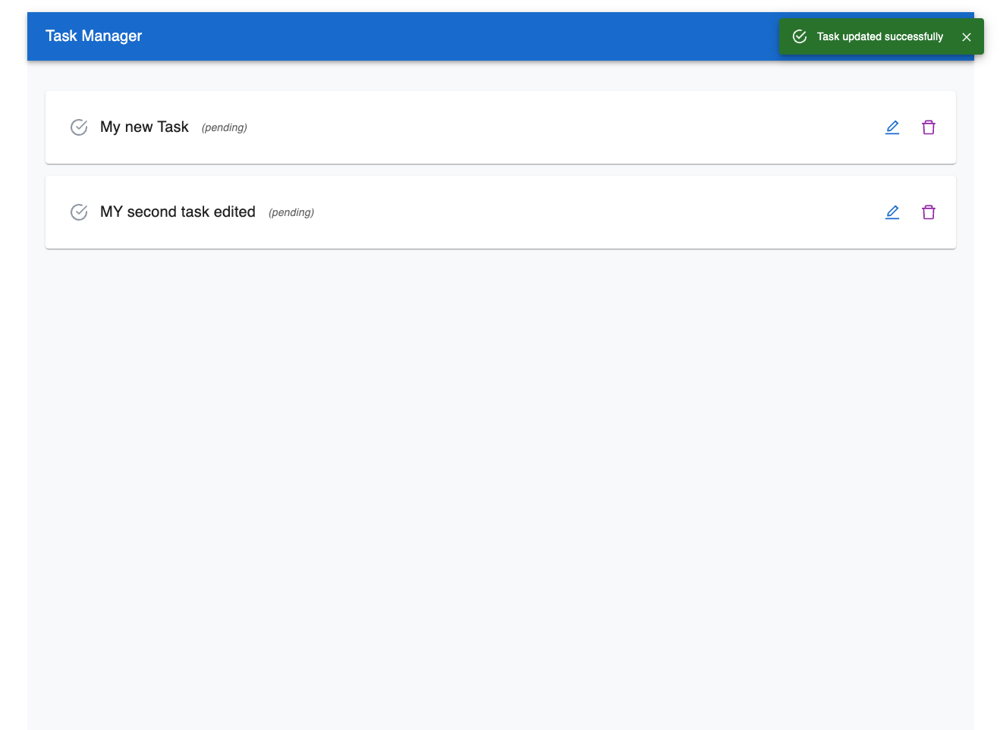
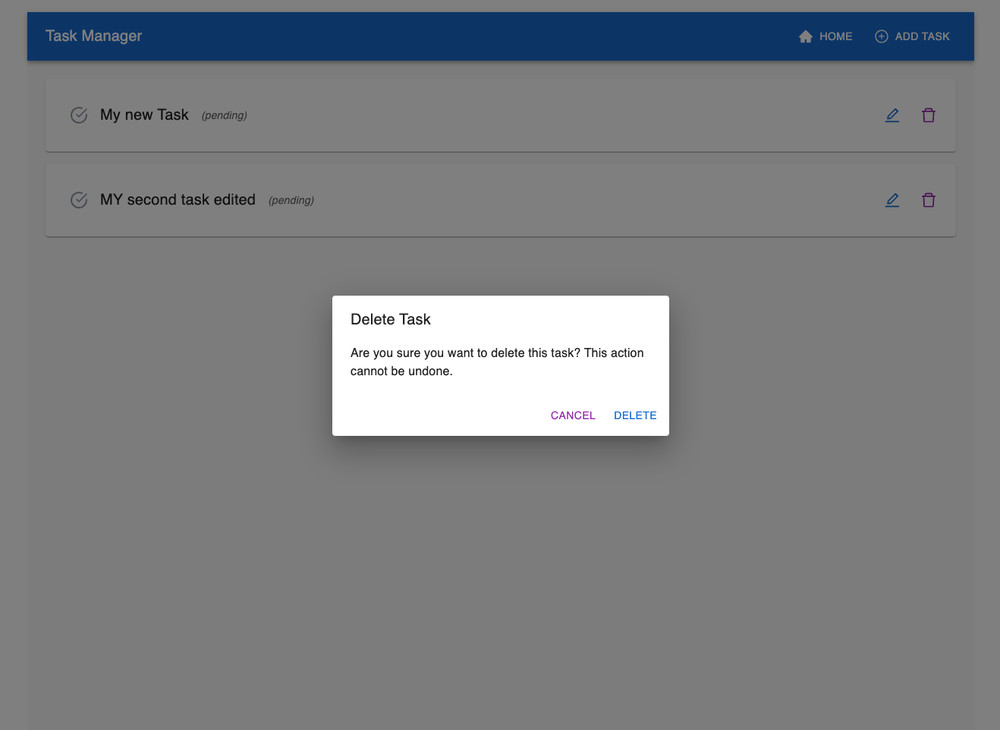
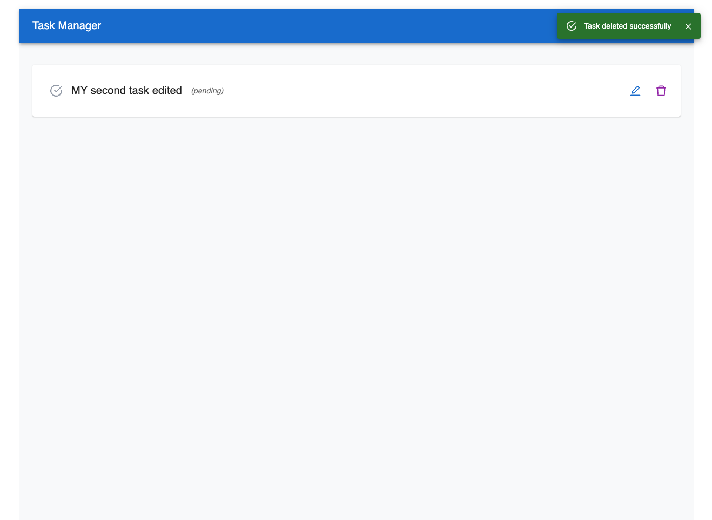

# 📝 Task Management System

This is a **Task Management System** built with **React**, **TypeScript**, and **Node.js**. Designed for scalability and modularity, it serves as a foundational system for managing tasks, with potential for further improvements and integrations.

## ✨ Features

- **Task List View**: Displays all tasks with real-time updates.
- **Task Creation**: Form validation for adding tasks using `react-hook-form` and `zod`.
- **Task Updating**: Modify tasks via a dialog interface.
- **Task Deletion**: Confirmation dialog for secure task removal.
- **Notifications**: Success and error alerts with Material UI’s `Snackbar`.
- **Modular Backend**: Organized with custom error handling.
- **Styled UI**: Built with TailwindCSS and Material UI for a polished appearance.
- **Fast Builds**: Developed using Vite for optimized build and development speeds.

## 🛠️ Tech Stack

- **Frontend**: React, TypeScript, Vite, @mui/material, TailwindCSS
- **Backend**: Node.js, Express, TypeScript
- **Package Manager**: `pnpm` for efficient dependency management
- **State Management**: RTK Query for API data handling
- **Routing**: React Router for frontend navigation

## 📋 API Endpoints

| Endpoint          | Method | Description             |
|-------------------|--------|-------------------------|
| `/tasks`          | GET    | Retrieve the list of tasks |
| `/tasks`          | POST   | Add a new task          |
| `/tasks/:id`      | PUT    | Update an existing task |
| `/tasks/:id`      | DELETE | Delete a task           |

### **Task Model**

```typescript
interface Task {
  id: string;
  title: string;
  status: 'pending' | 'completed';
}
```

## ⚙️ Technical Requirements

- **TypeScript**: Ensures type safety and improves developer experience.
- **Vite**: Preferred over CRA for faster builds and smaller bundle sizes.
- **In-Memory Storage**: Tasks stored temporarily in memory for this version.
- **Basic Error Handling**: Implemented in both frontend and backend.

## 📸 Screenshots










## 🚀 Getting Started

### Prerequisites

- **Node.js** (>= 14)
- **pnpm** (recommended package manager)

### Installation

1. **Clone the repository**:

    ```bash
    git clone https://github.com/AngelsProjects/task-manager.git
    ```

2. **Install dependencies**:

    ```bash
    cd task-manager
    pnpm install
    ```

3. **Run the application**:

    ```bash
    pnpm dev
    ```

## 🔍 Technical Decisions

- **Vite** over Create React App (CRA) for faster builds and better performance.
- **RTK Query** for API data fetching, which simplifies the codebase and improves state management.
- **Express** as a lightweight, flexible framework for handling backend routing and custom error handling.

## ⚖️ Trade-offs

- **In-Memory Storage**: Tasks are stored temporarily; database integration is planned for persistence.
- **Basic Error Handling**: Kept minimal but customizable for future refinement in production.
  
## 📈 Potential Improvements

- **Database Integration**: Add MongoDB or PostgreSQL for persistent task storage.
- **Real-Time Updates**: Use WebSockets or Server-Sent Events to synchronize tasks across clients in real time.
- **Offline Support**: Cache tasks locally (using IndexedDB or localStorage) for offline functionality.

## ⚠️ Known Limitations

- **CORS**: Configured for `http://localhost:3000` in development; adjust settings for production deployment.
- **Security**: Currently lacks authentication and authorization, needed for multi-user environments.

## 💡 AI Assistance

AI tools were utilized for brainstorming error-handling approaches and structuring the project. All code was reviewed and refined to ensure reliability and quality.

## 📁 Project Structure

```plaintext
tasks-management
├─ README.md
├─ backend
│   ├─ package.json
│   ├─ src
│   │   ├─ app.ts
│   │   ├─ controllers
│   │   │   └─ taskController.ts
│   │   ├─ models
│   │   │   └─ task.ts
│   │   ├─ routes
│   │   │   └─ taskRoutes.ts
│   │   ├─ server.ts
│   │   └─ utils
│   │       └─ errorHandler.ts
│   └─ tsconfig.json
├─ frontend
│   ├─ index.html
│   ├─ package.json
│   ├─ postcss.config.js
│   ├─ src
│   │   ├─ App.tsx
│   │   ├─ api
│   │   │   └─ taskApi.ts
│   │   ├─ app
│   │   │   └─ store.ts
│   │   ├─ components
│   │   │   ├─ ConfirmationDialog.tsx
│   │   │   ├─ SnackbarAlert.tsx
│   │   │   ├─ NotFound.tsx
│   │   │   ├─ TaskForm.tsx
│   │   │   ├─ TaskList.tsx
│   │   │   └─ UpdateTaskDialog.tsx
│   │   ├─ features
│   │   │   └─ taskSlice.ts
│   │   ├─ index.tsx
│   │   ├─ routes
│   │   │   └─ index.tsx
│   │   └─ styles
│   │       └─ global.scss
│   ├─ tailwind.config.js
│   ├─ tsconfig.json
│   └─ vite.config.ts
├─ package.json
├─ pnpm-lock.yaml
└─ pnpm-workspace.yaml
```

## 📄 License

This project is licensed under the **MIT License**. See the [LICENSE](LICENSE) file for details.
```

This README provides a comprehensive overview, with clear sections and formatting for ease of reading. Adjustments to placeholders (e.g., repository URL) would tailor it further to your setup. Let me know if you need further customization!